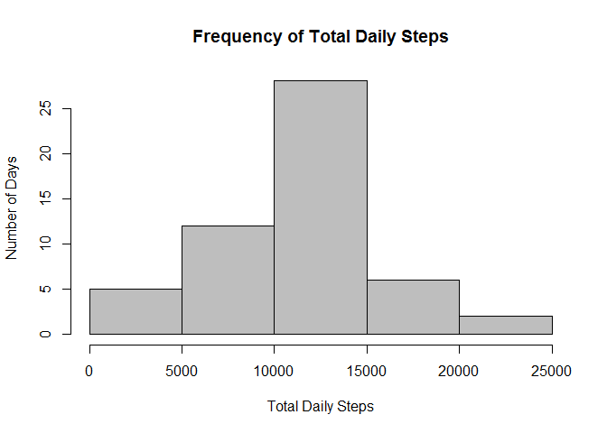
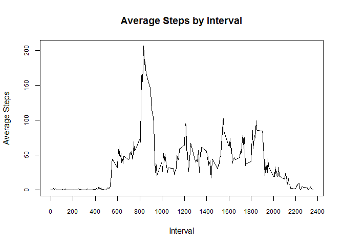
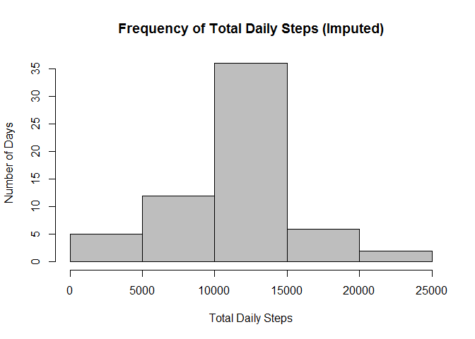
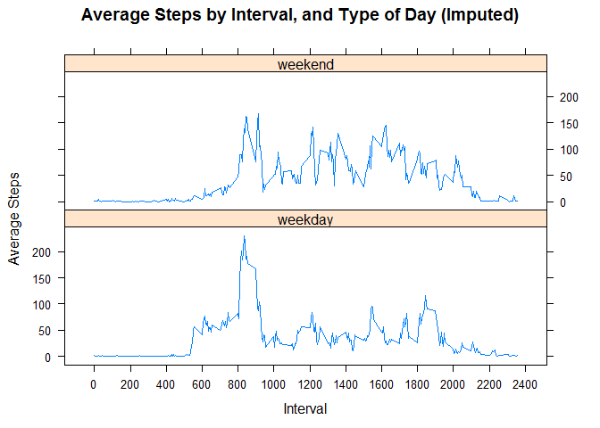

# Reproducible Research: Peer Assessment 1

## Loading and preprocessing the data
Load the data.

```r
library(dplyr)
library(lubridate)
library(lattice)
data <- read.csv("activity.csv", colClasses=c("integer", "Date", "integer"))
```

## What is mean total number of steps taken per day?
For this part of the assignment, you can ignore the missing values in the dataset.

```r
df <- na.omit(data)
```
1. Calculate the total number of steps taken per day

```r
df <- summarise(group_by(df, date), daily_steps=sum(steps))
```
2. Make a histogram of the total number of steps taken each day

```r
hist(df$daily_steps, col="gray",
     xlab="Total Daily Steps",
     ylab="Number of Days",
     main="Frequency of Total Daily Steps")
```

 

3. Calculate and report the mean and median of the total number of steps taken per day.

```r
mean_daily_steps <- mean(df$daily_steps)
median_daily_steps <- median(df$daily_steps)
```
- The mean total daily steps is **10766.19**.
- The median total daily steps is **10765**.

## What is the average daily activity pattern?
1. Make a time series plot (i.e. type = "l") of the 5-minute interval (x-axis) and the average number of steps taken, averaged across all days (y-axis).

```r
df_avg <- na.omit(data)
df_avg <- summarise(group_by(df_avg, interval), avg_steps=mean(steps))
plot(df_avg$interval, df_avg$avg_steps, type="l",
     xaxp=c(0, 2400, 12),
     cex.axis=0.75,
     xlab="Interval",
     ylab="Average Steps",
     main="Average Steps by Interval")
```

 

2. Which 5-minute interval, on average across all the days in the dataset, contains the maximum number of steps?

```r
max_avg_rec <- which.max(df_avg$avg_steps) 
max_avg_interval <- df_avg$interval[max_avg_rec]
max_avg_steps <- df_avg$avg_steps[max_avg_rec]
```
- Interval **#835** has the maximum average number of steps (206.17 steps).

## Imputing missing values
1. Calculate and report the total number of missing values in the dataset (i.e. the total number of rows with NAs)

```r
na_steps    <- sum(is.na(data$steps))
na_interval <- sum(is.na(data$interval))
na_date     <- sum(is.na(data$date))
```
- The dataset contains **2304** missing step values, **0** missing interval values, and **0** missing date values.  

2. Devise a strategy for filling in all of the missing values in the dataset. The strategy does not need to be sophisticated. For example, you could use the mean/median for that day, or the mean for that 5-minute interval, etc.
- Replace each missing value with the average number of steps for the matching 5-minute interval.

3. Create a new dataset that is equal to the original dataset but with the missing data filled in.

```r
df_imp <- merge(data, df_avg, by="interval")
df_imp <- mutate(df_imp, imputed=ifelse(is.na(steps), avg_steps, steps))
df_imp <- select(df_imp, steps=imputed, date, interval)
```
4. (a) Make a histogram of the total number of steps taken each day

```r
df_avg_imp <- summarise(group_by(df_imp, date), tot_steps=sum(steps))
hist(df_avg_imp$tot_steps, col="gray",
     xlab="Total Daily Steps",
     ylab="Number of Days",
     main="Frequency of Total Daily Steps (Imputed)")
```

 

4. (b) and Calculate and report the mean and median total number of steps taken per day.

```r
mean_daily_steps_imp <- mean(df_avg_imp$tot_steps)
median_daily_steps_imp <- median(df_avg_imp$tot_steps)
```
- The mean total daily steps is **10766.19**.
- The median total daily steps is **10766.19**.

4. (c) Do these values differ from the estimates from the first part of the assignment? 

```r
change_in_mean_val <- mean_daily_steps_imp - mean_daily_steps
change_in_median_val <- median_daily_steps_imp - median_daily_steps
```
- The change in the mean value is **0**.
- The change in the median value is **1.188679**.

4. (d) What is the impact of imputing missing data on the estimates of the total daily number of steps? 
- Imputing missing values raised the median total daily steps by a small amount.

## Are there differences in activity patterns between weekdays and weekends?
1. Create a new factor variable in the dataset with two levels – “weekday” and “weekend” indicating whether a given date is a weekday or weekend day.

```r
df_imp <- mutate(df_imp, day_type=factor(ifelse(wday(date) %in% c(1, 7), "weekend", "weekday")))
```

2. Make a panel plot containing a time series plot (i.e. type = "l") of the 5-minute interval (x-axis) and the average number of steps taken, averaged across all weekday days or weekend days (y-axis).

```r
df_wk <- summarise(group_by(df_imp, interval, day_type), avg_steps=mean(steps))
xyplot(avg_steps ~ interval | day_type,
       data=df_wk, type='l', layout=c(1, 2),
       scales=list(x=list(tick.number=12)),
       xlab="Interval",
       ylab="Average Steps",
       main="Average Steps by Interval, and Type of Day (Imputed)")
```

 
    
    
    


